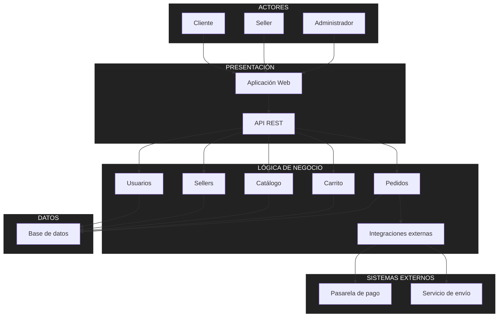

# Arquitectura inicial del sistema

## Diagrama de arquitectura

## Descripción

La arquitectura inicial se organiza en tres capas principales:

- **Presentación:** permite la interacción de los usuarios mediante la aplicación web y la API REST.
- **Lógica de negocio:** contiene los módulos de usuarios, sellers, catálogo, carrito y pedidos, responsables de procesar las funcionalidades del marketplace.
- **Datos:** permite almacenar y consultar la información del sistema mediante una base de datos.

Además, el módulo de **Pedidos** se comunica con un módulo de **Integraciones externas**, que permite conectar el sistema con la pasarela de pago y el servicio de envío.

Esta organización facilita la separación de responsabilidades y permite considerar los atributos de calidad de rendimiento, escalabilidad, seguridad y mantenibilidad.